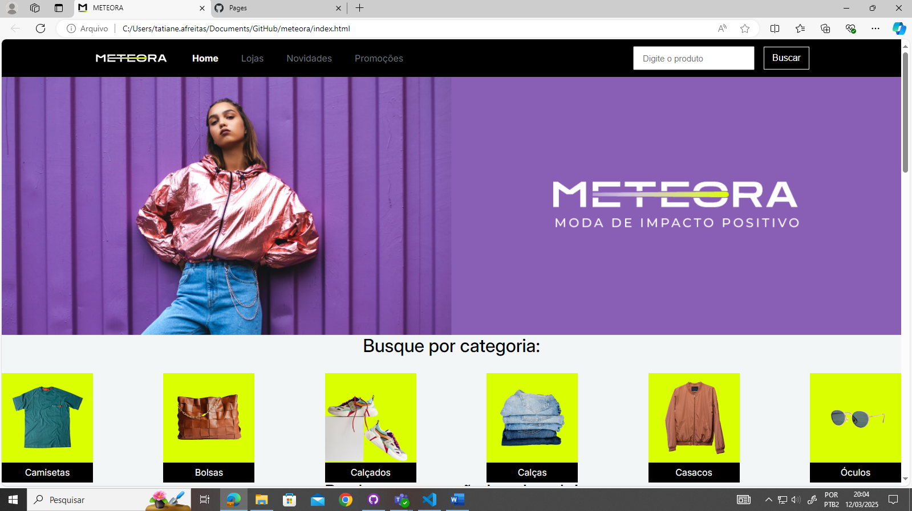

# Meteora

[LINK PARA SITE FUNCIONANDO](https://tatianealves13.github.io/meteora/)

**Descrição curta:**  
Site para uma loja de roupas fictício. O objetivo é treinar a programação de layouts.

---

## 🚀 Tecnologias Utilizadas

- **HTML5**: Estrutura básica do site.
- **CSS3**: Estilização e layout.
- 
---

## Imagem do projeto

Aqui você pode colocar capturas de tela ou imagens do seu projeto para ilustrar como ele se parece. Para adicionar imagens no seu README,use: 
---

 
